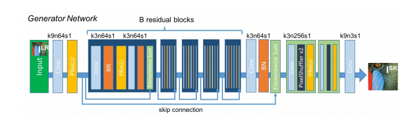
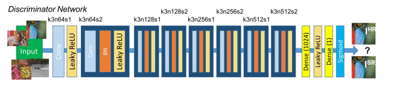
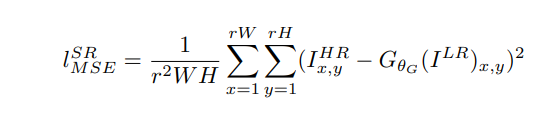
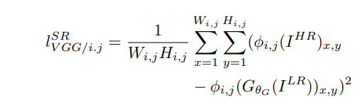
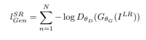
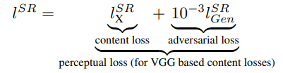
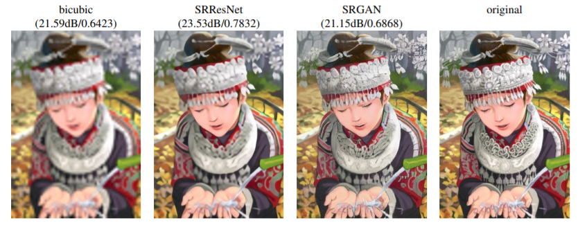

# Photo-Realistic Single Image Super-Resolution Using a Generative Adversarial Network

SRGAN was proposed by researchers at Twitter. The motive of this architecture is to recover finer textures from the image when we upscale it so that it’s quality cannot be compromised. There are other methods such as Bilinear Interpolation that can be used to perform this task but they suffer from image information loss and smoothing. In this paper, the authors proposed two architectures the one without GAN (SRResNet) and one with GAN (SRGAN). It is concluded that SRGAN has better accuracy and generate image more pleasing to eyes as compared to SRGAN.

# Generator Architecture

The generator architecture contains residual network instead of deep convolution networks because residual networks are easy to train and allows them to be substantially deeper in order to generate better results. This is because the residual network used a type of connections called skip connections.



There are B residual blocks (16), originated by ResNet. Within the residual block, two convolutional layers are used, with small 3×3 kernels and 64 feature maps followed by batch-normalization layers and ParametricReLU as the activation function.

The resolution of the input image is increased with two trained sub-pixel convolution layers.

This generator architecture also uses parametric ReLU as an activation function which instead of using a fixed value for a parameter of the rectifier (alpha) like LeakyReLU. It adaptively learns the parameters of rectifier and   improves the accuracy at negligible extra computational cost

  During the training, A high-resolution image (HR) is downsampled to a low-resolution image (LR). The generator architecture than tries to upsample the image from low resolution to super-resolution. After then the image is passed into the discriminator, the discriminator and tries to distinguish between a super-resolution and High-Resolution image and generate the adversarial loss which then backpropagated into the generator architecture.

# Discriminator Architecture

The task of the discriminator is to discriminate between real HR images and generated SR images.   The discriminator architecture used in this paper is similar to DC- GAN architecture with LeakyReLU as activation. The network contains eight convolutional layers with of 3×3 filter kernels, increasing by a factor of 2 from 64 to 512 kernels. Strided convolutions are used to reduce the image resolution each time the number of features is doubled. The resulting 512 feature maps are followed by two dense layers and a leakyReLU applied between and a final sigmoid activation function to obtain a probability for sample classification. 



# Loss Function

The SRGAN uses perpectual loss function (LSR)  which is the weighted sum of two loss components : content loss and adversarial loss. This loss is very important for the performance of the generator architecture:

* Content Loss: We use two types of content loss in this paper : pixelwise MSE loss for the SRResnet architecture, which is most common MSE loss
for image Super Resolution. However MSE loss does not able to deal with high frequency content in the image that resulted in producing overly smooth images. Therefore the authors of the paper decided to  use loss of different VGG layers. This VGG loss is based on the ReLU activation layers of the pre-trained 19 layer VGG network. This loss is defined as follows:





* Adversarial Loss: The Adversarial loss is the loss function that forces the generator to image more similar to high resolution image by using a discriminator that is trained to differentiate between high resolution and super resolution images.



### Therefore total content loss of this architecture will be :



# Result




# Citation

```
@INPROCEEDINGS{8099502,  author={Ledig, Christian and Theis, Lucas and Huszár, Ferenc and Caballero, Jose and Cunningham, Andrew and Acosta, Alejandro and Aitken, Andrew and Tejani, Alykhan and Totz, Johannes and Wang, Zehan and Shi, Wenzhe},  booktitle={2017 IEEE Conference on Computer Vision and Pattern Recognition (CVPR)},   title={Photo-Realistic Single Image Super-Resolution Using a Generative Adversarial Network},   year={2017},  volume={},  number={},  pages={105-114},  doi={10.1109/CVPR.2017.19}}

```